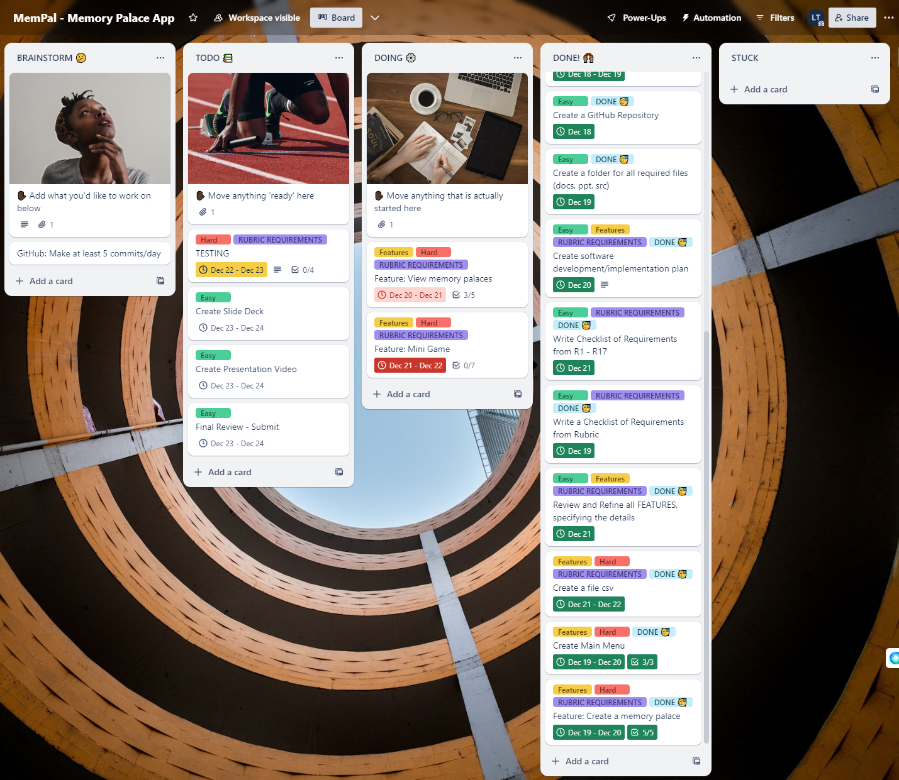
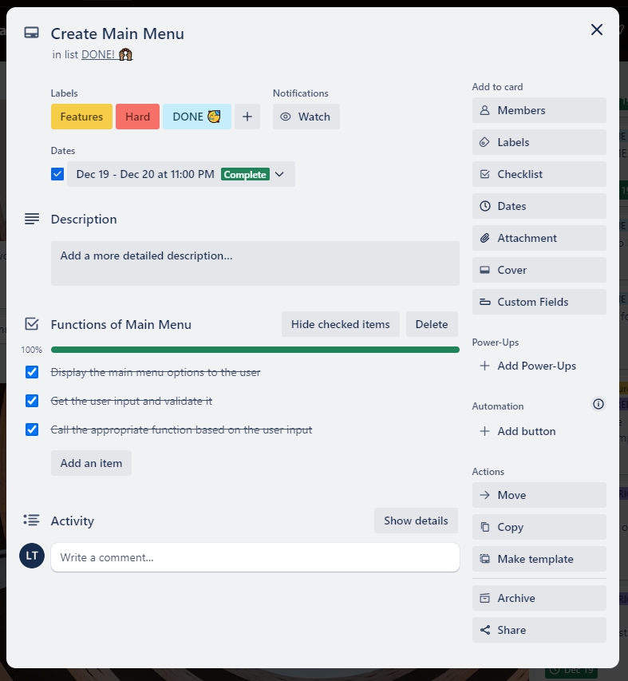
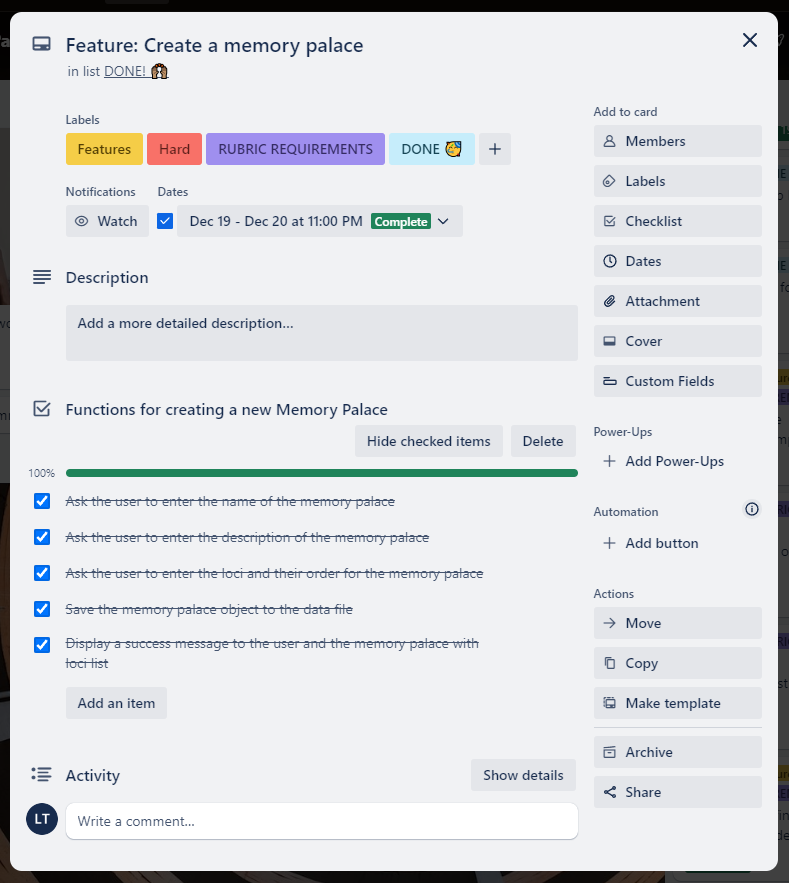
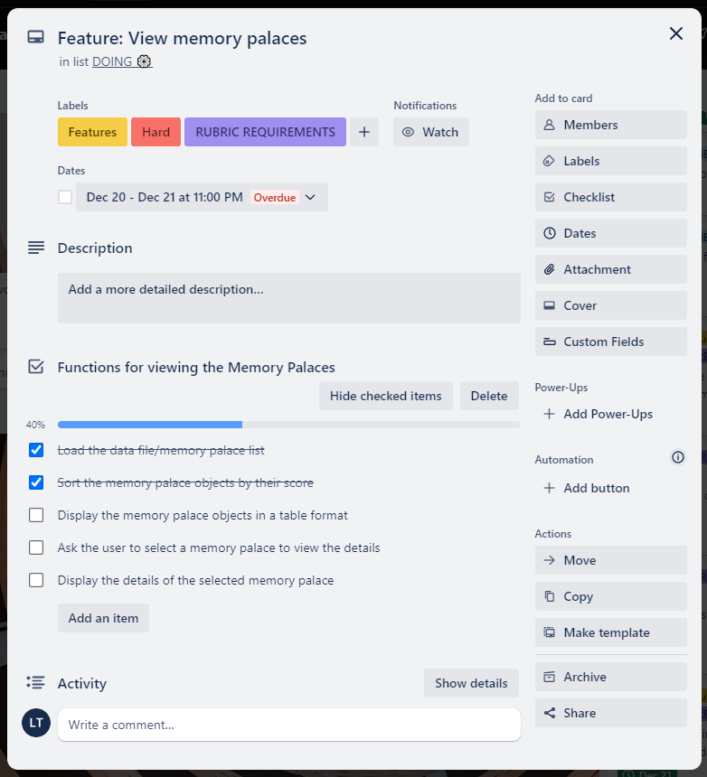
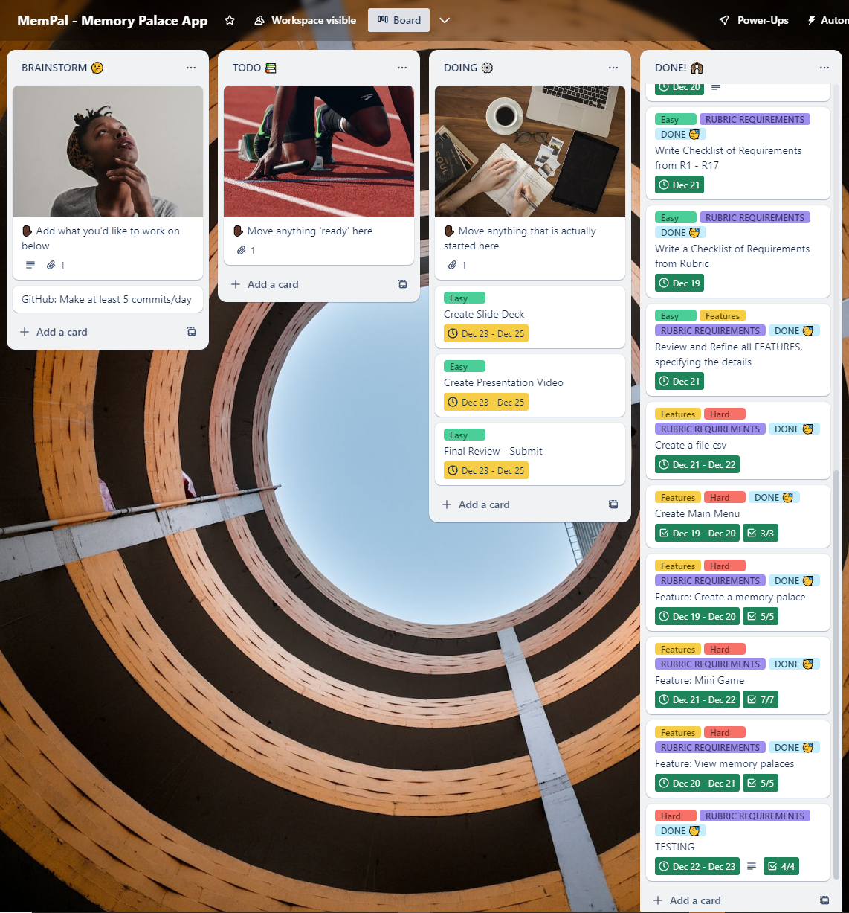
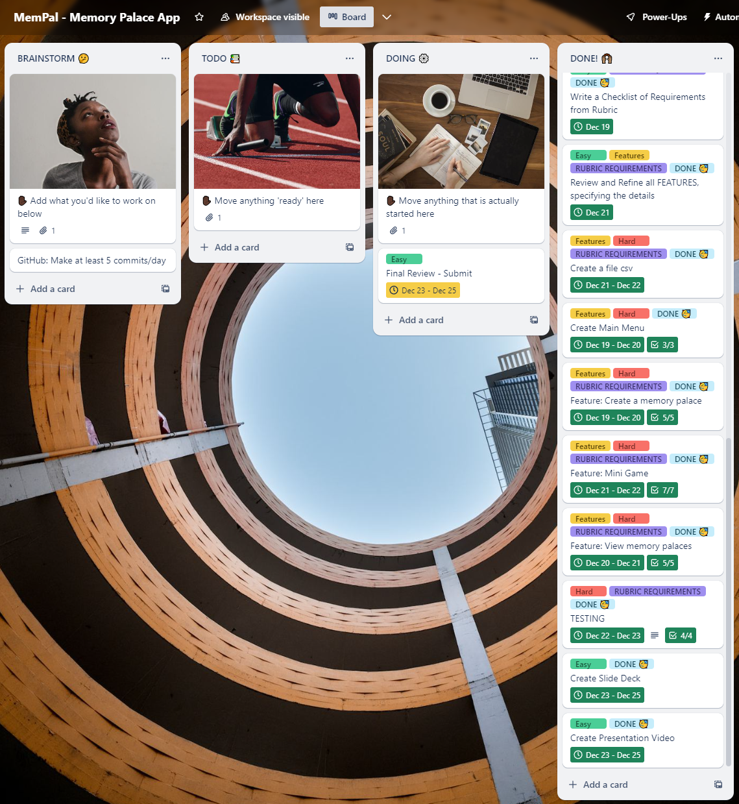

# T1A3 - PROJECT: TERMINAL APPLICATION

# MemPal: A Python Terminal App for Creating and Editing Memory Palaces

### Introduction

MemPal is a terminal application that allows users to create and manage their own memory palaces. A memory palace is a mnemonic technique that involves associating information with specific locations in a familiar environment. This app is created based on this memory technique to assist with creating, editing and reviewing Memory Palace to improve user memory and learning capacity.

MemPal also includes a mini game that tests the user’s ability to recall items in the memory palaces.

MemPal is written in Python and runs on the command line. It accepts user input in the form of text and produces printed output or interacts with the file system.

## Source Control Repository and Presentation Links:

### Github Repo: https://github.com/leonardoXLT/XuanLapTRAN_T1A3
### Presentation Video: https://youtu.be/5LctkffGn58

## Slide Deck

The slide deck contains:
- A walk-through of the terminal application, its features and how it is used
- A walk-through of the logic of the terminal application and code
- A review of the development/build process including challenges, ethical issues, favourite parts, etc.

## Code Style Guide or Styling Conventions

### PEP8 Compliance

This code adheres to PEP8, the official style guide for Python code. This includes conventions for indentation (4 spaces per indentation level), maximum line length (79 characters), and other formatting rules.

This code also adheres to DRY Principle.

# Features and Functionalities

MemPal has the following features and functionalities:

1. Create a memory palace: The user can enter the name of a memory palace, and then add loci and its number order.

2. View memory palaces: The user can view a list of all their memory palaces, sorted by the scores they achieved in the mini game. The user can also view the details of each memory palace, such as the name, loci, and its number order. The user can also edit or delete existing memory palaces.

3. Play the mini game: The user can select a memory palace and play a mini game that randomly quizzes them on the items associated with each locus. The user will get points for correct answers. The user’s score will be saved and used to sort the memory palaces.

## **Implementation Plan**

This project uses a Trello board for project management.

Each task/feature is represented by a card on the Trello board.

Cards are moved across lists to represent their status (e.g., “To Do”, “Doing”, “Done”).

Each card should have a deadline, which is set based on the estimated time to complete the task.

Labels are used to categorize cards into: dificulty level, feature, rubric requirements, done status


### Usage of a Trello platform

#### 15 - 18/12/2023

- Most of my time was spent on reviewing python, doing some python practice and trying to catch/generate as many ideas as possible.

- I've done some research on google too to see some of the common interesting ideas.

- Created Trello account, then created a board using a simple template.

- Created a simple Readme framework to follow/update

- Created a simple Implementation plan to follow/update

- Got idea approved on Monday 18/12/2023


---

#### 18 - 19/12/2023

- Created a more detailed Implementation plan to follow/update
- Created Trello cards for the Implementation plan
- Created folder for the project (docs, ppt, src)
- Did few more Python reading, project requirements, Rubric notes,etc.
- Created a Github repository


---

#### 20 - 21/12/2023

- Time spent for preparing second interview for a job opening (positive feedback)
- Less works done until evening 21/12/2023, but back on track.
- Created a more detailed README file, pushed to GitHub Repository (private)
- Worked on "Main Menu" and feature "Create a memory palace"


---

#### 22 - 23/12/2023

- Spent most of my time coding and testing. 
- Created Menu, CSV, functions.
- Getting familiar with PEP8, DRY, error handling.






---

#### 24/12/2023

- Spent most of my time coding and testing.
- Stuck with score calculation and struggled to work around.
- Most error handling is done with while loop and if-else, no obvious error found.
- Tests were designed to see if the functions works, 3 out of 4 tests were done successfully. The failed test was on minigame feature, which was tested manually and successful.




---

#### 25/12/2023

- Spent most of my time styling/designing, writing installation guide, bash script.
- Created Slide
- Created Presentaion video
- Final Review
- Added final touch




---

## Help Documentation

The help documentation for MemPal provides a set of instructions on how to install and use the application. The help documentation covers the following topicsL

- Installation guide
- Dependencies
- Hardware requirements
- How to use command line arguments

### Installation Guide

1. Clone the repository: First, you need to clone the repository containing the MemPal app to your local machine. You can do this using the `git clone` command followed by the URL of the repository.

2. Create a virtual environment: It’s a good practice to create a virtual environment for your Python projects. You can create one using the `venv` module:

```
python3 -m venv mempal-env
```

3. Activate the virtual environment: The command to activate the virtual environment depends on your operating system:

    On Windows, run: `mempal-env\Scripts\activate`

    On Unix or MacOS, run: `source mempal-env/bin/activate`

4. Install the dependencies: Once the virtual environment is activated, you can install the required packages using pip:

```
pip3 install -r requirements.txt
```

5. Run the application: Finally, you can run the application:

```
python3 main.py
```

### Dependencies

The MemPal app requires the following Python packages:

- colorama
- pyfiglet
- colored
- random (part of the Python Standard Library)

These should be listed in your `requirements.txt` file.

### System/Hardware Requirements

MemPal does not have any specific hardware requirements to run. However, it is recommended that you have a computer that meets the following minimum specifications, which is fairly easy:

- Processor: 2 GHz or faster
- Memory: 4Gb or more
- Disk space: 500 MB or more

### How to Use Command Line Arguments

Here’s a step-by-step guide on how to run the MemPal app using the run.sh script:

1. **Open Terminal**: Open a terminal window. It is recommended to use VS Code, This can usually be done by searching for VS Code in your computer’s search bar.

2. **Navigate to the Project Directory**: Use the `cd` command to navigate to the directory containing your MemPal project and the `run.sh` script.

3. **Grant Execution Permissions**: Before you can run the `run.sh` script, you may need to grant it execution permissions. You can do this with the following command:

```
chmod +x run.sh
```

4. **Run the Script**: Now you can run the script with the following command:

```
./run.sh
```

This script checks if Python 3 is installed, creates a virtual environment if it doesn’t exist, activates the virtual environment, installs the necessary Python packages (colorama, pyfiglet, colored), and then runs the main.py script.


## CODE REQUIREMENTS

### **Programming concepts and structures**

- variables and variable scope
- loops and conditional control structures
- write and utilise simple functions
- error handling
- input and output
- importing a Python package
- using functions from a Python package
- Apply DRY (Don’t Repeat Yourself) coding principles


## Testing

I have created 4 tests but unfortunately struggled to pass the test 3 and 4 successfully. I did the tests manually for test 3 and 4 and it was successful with expected result.

It was too hard that I did use ChatGPT to help with Test 3 and 4, but still failed for test 3. Luckily, I was able to find the fix for the test 4.

I think one of the reason be the random package imported could somehow contribute to the failed result, where the minigame is required to have questions asked randomly.

All tests were done to see:
- if all the main features/functions are able to run without error,
- ensuring that the error handling function was in place, and
- the output returns as expected.

### **The tests are as following:**

### Test 1: test_main_1_create.py

This test checks the main feature of creating a new memory palace.

It mocks the input function to simulate user input for the name of the memory palace, and the add_mempal function to simulate adding loci to the memory palace.

It also mocks the open function to simulate file operations.

The assertions check that the open function is called with the correct arguments, the input function is called with the correct prompt, and the add_mempal function is called correctly.

This test is highly relevant as it ensures that a new memory palace can be created correctly.


### Test 2: test_main_2_view.py

This test checks the main feature of viewing and editing an existing memory palace.

It mocks the input function to simulate user input for selecting a memory palace and choosing not to edit it, and the open function to simulate reading from a file.

The assertion checks that the open function is called with the correct arguments.

Additional tests were done manually as per below, due to the extensive options of this view_edit_mempal function:

1. 'Add next'(y): can add new loci, can choose to keep adding, can choose to finish
2. 'Edit'(e): can choose which locus to edit, can return error when choosing out of range
3. 'Remove Memory Palace'(r): can remove memory palace once selected
4. 'Finish'(n): already done as part of pytest test checking if it can run the function, select/view the memory palace from opening the csv file, then exit with 'Finish'(n)

This test is highly relevant as it ensures that an existing memory palace can be viewed and optionally edited.


### Test 3: test_main_3.py

This test case is designed to test the minigame function from my app.

The minigame function is expected to interact with the user through input and output.

The pytest test created was failed and a manual test is done with successful intended outcome.

To manually test this without pytest, I would need to run the minigame function and try every options. This also means I would need to have a ‘Mempal.csv’ file ready for the test.

In this minigame, it was designed to be fun and easy to follow (it's a game! :). Once answered, the score is showed and it was correctly calculated as expected.

### Test 4: test_main_4_add.py

This test checks the main feature of adding loci to a memory palace.

It mocks the input function to simulate user input for entering loci and choosing to add next or finish.

The assertions check that the returned loci are correct and that the input function is called the correct number of times.

This test is highly relevant as it ensures that loci can be added to a memory palace correctly.


