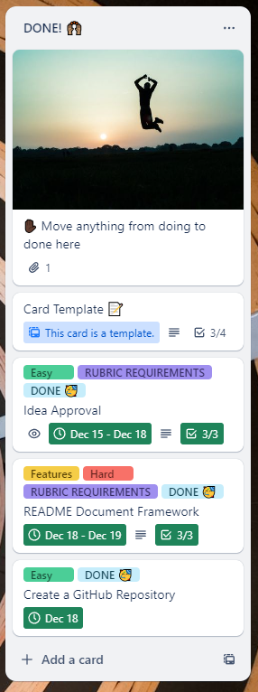
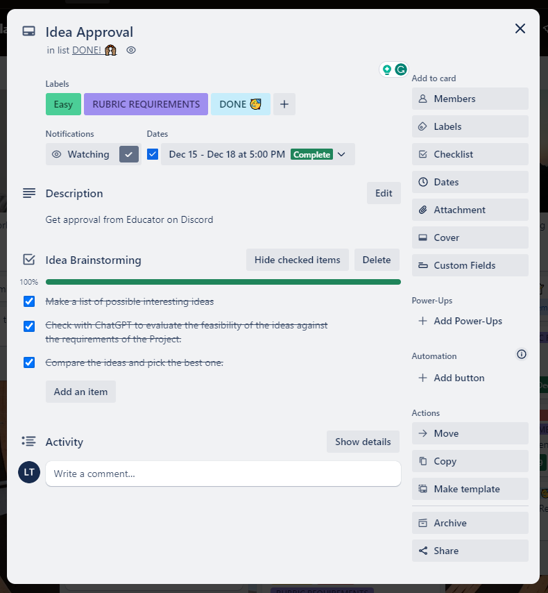
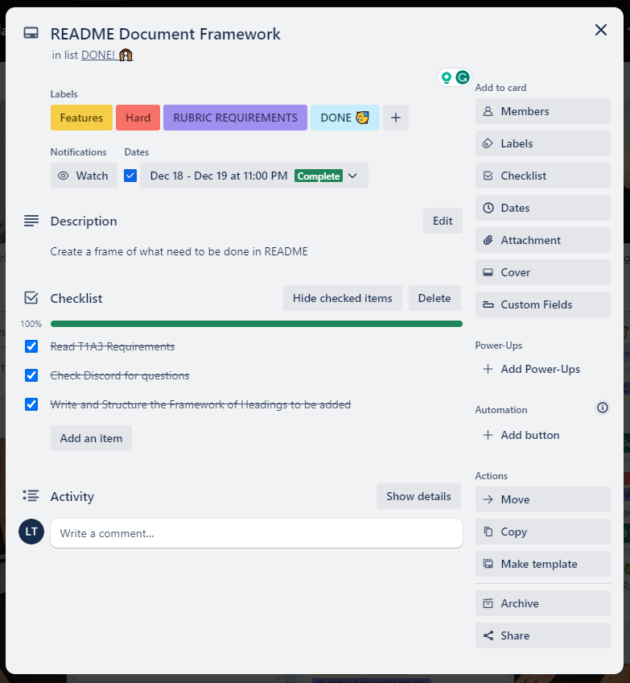

# T1A3 - PROJECT: TERMINAL APPLICATION

# MemPal: A Python Terminal App for Creating and Editing Memory Palaces

### Introduction

MemPal is a terminal application that allows users to create and manage their own memory palaces. A memory palace is a mnemonic technique that involves associating information with specific locations in a familiar environment. This app is created based on this memory technique to assist with creating, editing and reviewing Memory Palace to improve user memory and learning capacity.

MemPal also includes a mini game that tests the user’s ability to recall items in the memory palaces.

MemPal is written in Python and runs on the command line. It accepts user input in the form of text and produces printed output or interacts with the file system.

## Source Control Repository and Presentation Links:

### Github Repo: https://github.com/leonardoXLT/XuanLapTRAN_T1A3
### Presentation Video: 

## Slide Deck

The slide deck contains:
- A walk-through of the terminal application, its features and how it is used
- A walk-through of the logic of the terminal application and code
- A review of the development/build process including challenges, ethical issues, favourite parts, etc.

## Code Style Guide or Styling Conventions

The code style guide or styling conventions that MemPal adheres to are based on the PEP 8 style guide for Python code.

DRY Principle

# Features and Functionalities

MemPal has the following features and functionalities:

1. Create a memory palace: The user can enter the name and description of a memory palace, and then add loci and its number order. The user can also edit or delete existing memory palaces.

2. View memory palaces: The user can view a list of all their memory palaces, sorted by the scores they achieved in the mini game. The user can also view the details of each memory palace, such as the name, description, loci, and its number order.

3. Play the mini game: The user can select a memory palace and play a mini game that randomly quizzes them on the items associated with each loci. The user will get points for correct answers. The user’s score will be saved and used to sort the memory palaces.

## **Implementation Plan**

Use Trello board

### Usage of a Trello platform

#### 15 - 18/12/2023

- Most of my time was spent on reviewing python, doing some python practice and trying to catch/generate as many ideas as possible.

- I've done some research on google too to see some of the common interesting ideas.

- Created Trello account, then created a board using a simple template.

- Created a simple Readme framework to follow/update

- Created a simple Implementation plan to follow/update

- Got idea approved on Monday 18/12/2023

---

#### 18 - 19/12/2023

- Created a more detailed Implementation plan to follow/update
- Created Trello cards for the Implementation plan
- Created folder for the project (docs, ppt, src)
- Did few more Python reading, project requirements, Rubric notes,etc.
- Created a Github repository

---

#### 20 - 21/12/2023

- Time spent for preparing second interview for a job opening (positive feedback)
- Less works done until evening 21/12/2023, but back on track.
- Created a more detailed README file, pushed to GitHub Repository (private)
- Worked on "Main Menu" and feature "Create a memory palace"

---

#### 22 - 23/12/2023

- Created Menu

## Help Documentation

The help documentation for MemPal provides a set of instructions on how to install and use the application. The help documentation covers the following topicsL

- Installation guide
- Dependencies
- Hardware requirements
- How to use command line arguments

### Installation Guide

### Dependencies

### System/Hardware Requirements

MemPal does not have any specific hardware requirements to run. However, it is recommended that you have a computer that meets the following minimum specifications, which is fairly easy:

- Processor: 2 GHz or faster
- Memory: 4Gb or more
- Disk space: 500 MB or more

### How to Use Command Line Arguments

## CODE REQUIREMENTS

### **Programming concepts and structures**

- variables and variable scope
- loops and conditional control structures
- write and utilise simple functions
- error handling
- input and output
- importing a Python package
- using functions from a Python package
- Apply DRY (Don’t Repeat Yourself) coding principles

## Testing

pytest package

